# Spring Cloud & React MicroServices
---

## 목차

1. 소개
2. 모듈 구성
3. 예제 기능 설명
4. 배포 및 테스트
    * 4.1 실행 환경 준비
    * 4.2 소스 다운로드
    * 4.3 local 프로파일 배포
    * 4.4 develop 프로파일 배포 (docker-compose)
    * 4.5 release 프로파일 배포 (Kubernetes)
5. HTML 기능 테스트
    * 5.1 파일 업로드/다운로드
    * 5.2 DB 백업/복원
6. Spring Cloud 환경 구성
    * 6.1 Config 구성
    * 6.2 Logging 구성
7. 확장형 데이터베이스 설계
    * 7.1 DataSource 구성
    * 7.2 JPA 구성
    * 7.3 트랜잭션 처리
8. 감사
   * 8.1 엔티티 감사
   * 8.2 감사 로그
9. 캐쉬
10. util 패키지
11. enum 타입


---
## 1. 소개
Spring Cloud 및 React 기반 MSA 예제

### 1.1 사용 기술
- 백엔드
  - Spring Cloud, Security 등
  - JPA/Querydsl
  - H2 DataBase
- 프론트
  - React
- 빌드
  - Maven

### 1.2 프로파일 및 배포 환경
- local : 로컬 CLI 배포
- develop : docker-compose
- release : Kubernetes

### 1.3 예제 주제 
- Task 관리
- DB 백업 및 복원
- 파일 업로드/다운로드


---
## 2. 모듈 구성
- **백엔드**
  - cloud-config 
    - 로컬 저장소 경로 : cloud-config/src/main/resources/cfg-repo
  - cloud-eureka
  - cloud-gateway
  - base-domain : 업무 도메인에서 필요로 하는 JPA Entity/Repository, DTO, Enum 클래스 정의
  - base-common : 공통 유틸리티 및 Spring Boot 공통 설정 정의
  - svc-task : Task 관리 API 제공
    - Spring Boot 환경 설정은 base-common에 정의된 공통 설정 적용      
    - JPA Entity/Repository/Enum 등은 base-domain 모듈에 정의된 클래스 사용
    - 따라서, 모듈 기능 구현에 필요한 Controller/Service/Repository/Dto 클래스들만 포함 
- **프론트**
  - front-task : Task 관리 프론트 사이드 UI 인터페이스 제공
- **루트(a-parent)**
  - Maven 각 모듈들을 그룹화 하기 위한 공통의 부모 모듈
  - 공통 프로파일, 프로퍼티 정의 및 리소스 처리 체계 정의

---
## 3. 예제 기능 설명
- **Task 관리**
  - Task 추가/수정/검색/페이징/삭제 
  - Task간 계층 구조 가능 (타 Task을 상위 Task로 지정 가능)
    - 1개의 엔티티 대상 Many-to-Many 릴레이션 관계
    - Task 완료 처리시, 완료되지 않은 상위 Task가 있을시, 완료 처리 불가
    - Task 삭제시, 해당 Task를 상위 Task로 지정하고 있는 다른 Task가 있을 경우, 상위 Task 목록에서 자동 제거
  - 단위 테스트 : Task 관리 시나리오 테스트 추가
- **DB 관리**    
  - 데이터베이스 온라인 백업(Export)
  - 데이터베이스 온라인 복구(Import)

---
## 4. 배포 및 테스트

### 4.1 실행 환경 준비
배포 진행을 위해 다음과 같은 소프트웨어 설치가 필요합니다.
- 백엔드 : JDK(Ver 11), Maven
- 프론트 : NodeJS(npm)
- 서비스 : Redis
- 배포환경 : Docker, Kubernetes

### 4.2 소스 다운로드

```shell
$ git clone https://github.com/kangwemin/kangwemin.git
```

### 4.3 local 프로파일 배포

- 사전 확인 사항
  - 모듈별 포트 및 컨텍스트 경로
    - 설정 파일 : application.yml _(cloud-config/src/main/resources/cfg-repo)_
    ```yaml
    app:
    port:
    #   cloud-config:   9001
        cloud-eureka:   9002
        cloud-gateway:  8000 
        svc-task:       8001
    path:
    #   cloud-config:   /
        cloud-eureka:   /
        cloud-gateway:  /
        svc-task:       /task
    ```

  - local 프로파일 사용 경로들
    - 설정 파일 : application-local.yml _(cloud-config/src/main/resources/cfg-repo)_
    ```yaml
    app:                                               
      log-base-path: ${user.home}/wmkang/logs          
      file:                                            
        upload:                                        
          base-path: ${user.home}/wmkang/storage/upload
    ```
- **Redis 서버 기동**
  - 디폴트 6379 포트 사용
  - 인증없는 접속 허용 필요 

- 프로젝트 전체 빌드
  - 프로젝트 최상위 폴더에서 다음 명령으로 빌드 진행
```shell
$ mvn install -DskipTests=true
```

- Spring Cloud 인프라 서비스 기동
  - cloud-config, cloud-eureka, cloud-gateway 3개 모듈로 각각 이동하여, 순서대로 실행
```shell
cloud-config$ ./mvnw spring-boot:run
cloud-eureka$ ./mvnw spring-boot:run
cloud-gateway$ ./mvnw spring-boot:run
```
- 단위 테스트 실행
  - svc-task 폴더로 이동하여, 다음 명령어로 단위 테스트 실행
```shell
svc-task$ mvn test
```

- 단위 테스트 확인 사항 : DB
  - test 환경구성 : application-test.yml _(cloud-config/src/main/resources/cfg-repo)_
  - 아래 설정에 의해 h2 폴더 아래 3개의 DB 파일이 생성되어야 하나, 실제 2개만 사용하게 되므로 2개의 파일만 생성됩니다.
```yaml
      manage:
        jdbc-url: jdbc:h2:file:./h2/manage-test
      service-1:
        jdbc-url: jdbc:h2:file:./h2/service1-test
      service-2:
        jdbc-url: jdbc:h2:file:./h2/service2-test
  jpa:
    properties:
      hibernate:
        hbm2ddl:
          auto: create
```
- 단위 테스트 확인 사항 : 테스트 클래스 
  - Task 관리 테스트 : wmkang.task.controller.TaskControllerTest
    - Task 생성, 조회, 상위 타스트 설정, 상위 상태에 따른 수정 테스트 등
  - 권한 접근 제어 테스트 : wmkang.task.controller.RoleControllerTest
    - URL 및 메소드 단위 권한 설정에 따른, 사용자 권한별(USER, MANAGER, ADMIN) 접근 제어 테스트 

- **Task 백엔드 서비스 기동**
  - 단위 테스트 실행시와 동일하게, 엔티티 테이블들이 생성되고, 로그인 사용자 등 일부 테스트 데이터가 추가됩니다.
  ```shell
  svc-task$ ./mvnw spring-boot:run
  ```
&nbsp;&nbsp;    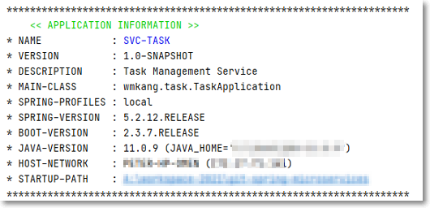

- Task 프론트 빌드 _(일부 Warning이 출력될 수 있으나, 무시하셔도 됩니다)_
```shell
front-task$ npm install
```

- **Task 프론트 기동**
  - cloud-gateway 주소 및 포트를  REACT_APP_API_URL 파라미터로 지정
    - svc-front 프로세스 관점이 아닌, 접속할 브라우저 관점에서 Gateway 주소 지정
  - Gateway 오류가 발생할 경우, Eurka에 등록된 svc-task 주소를 즉시 인식하지 못했기 때문이므로, 잠시 기다리면 해결됩니다. 
  
```shell
# Windows
front-task> set "REACT_APP_API_URL=http://127.0.0.1:8000" && npm start

# Linux, Mac
front-task$ REACT_APP_API_URL=http://127.0.0.1:8000 npm start
```
- 브라우저 실행 및 접속
```shell
http://127.0.0.1:3000
```
- **최초 접속 화면** 
  - svc-task 기동시 추가된 사용자 로그인 정보가 기본 셋팅되어 있습니다.<br/>
&nbsp;&nbsp;    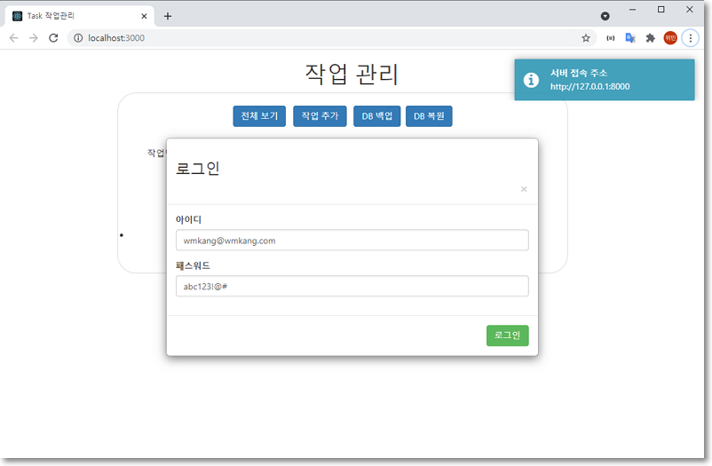

- **로그인**<br/>
&nbsp;&nbsp;    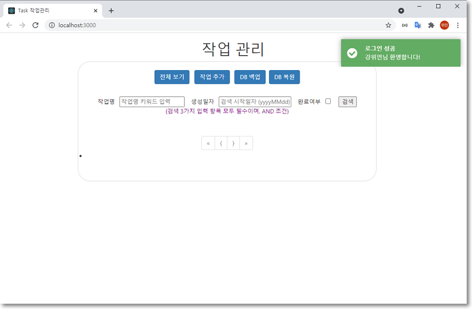

- **Task 관리**<br/>
  - 상단의 '작업추가' 버튼을 사용하여, 신규 작업을 등록할 수 있습니다.
  - 등록된 작업의 우측, '수정', '삭제' 버튼으로 수정 또는 삭제할 수 있습니다.
  - 신규 등록 및 수정시, 상위 작업을 지정할 수 있습니다
    - 작업명이 아닌 아이디 번호(예: 1, 2, 3)를 입력해야 합니다.
  - 상단의 '전체보기' 또는 그 아래 '검색' 버튼을 통해, 전체 또는 원하는 조건의 작업을 검색할 수 있습니다.<br/>
&nbsp;&nbsp;    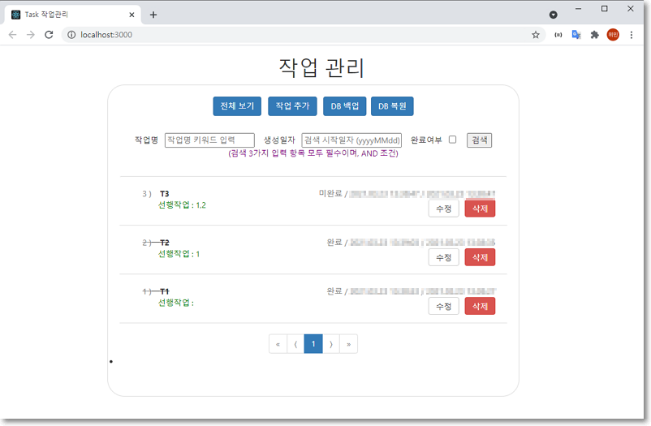

- **DB 관리:백업(익스포트)**<br/>
  - 전체 작업들의 현재 상태를 백업 파일로 보관할 수 있습니다.<br/>
&nbsp;&nbsp;    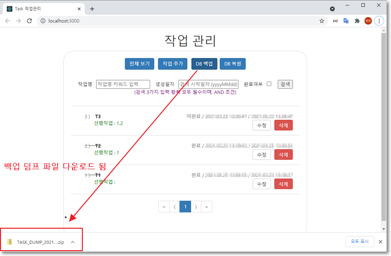

- **DB 관리:복구(임포트)**
  - 기존 백업 파일을 사용하여, 과거 시점으로 복귀할 수 있습니다.
  - 시각적 확인을 위해, 백업 후 몇 개의 Task 추가/삭제 후, 복구 기능을 테스트해 보시기 바랍니다.<br/>
&nbsp;&nbsp;    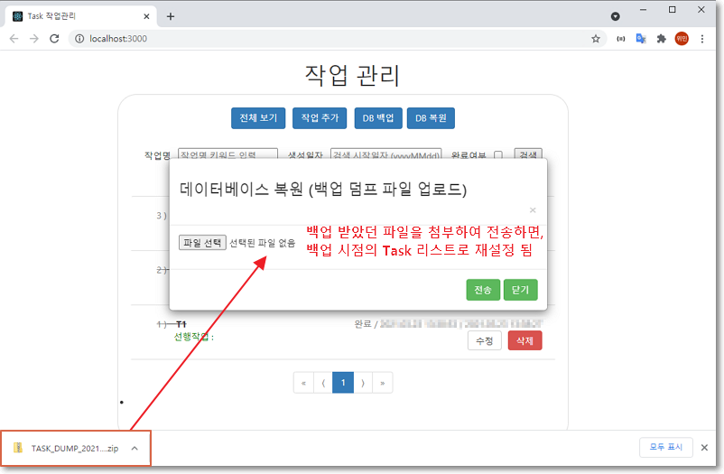
    
- **DB 파일, 임포트/익스포트 파일** 
  - /svc-task/h2 폴더    <br/>
&nbsp;&nbsp;    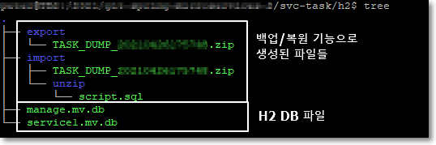

### 4.4 develop 프로파일 배포 _(docker-compose)_

- 프로젝트 전체 빌드
  - 프로젝트 최상위 폴더에서 develop 프로파일로 빌드 진행
```shell
$ sudo mvn install -Pdevelop -DskipTests=true
```
- 도커 이미지 확인 (총 5개)
  - Maven install 단계에서 도커 이미지 빌드를 함께 진행하도록 설정되어 있어, 빌드 후 생성된 이미지를 바로 확인할 수 있습니다.
```shell
$ sudo docker images | grep wmkang
```
  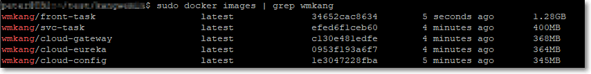
  

- 서비스 호스트 주소 설정
  - docker-compose.develop.yml 파일을 열고, `REACT_APP_API_URL` 설정값을 도커 이미지가 실행될 호스트 주소로 변경해야 합니다.
```yaml
  front-task:
    environment:
      - REACT_APP_API_URL=http://172.30.1.34:8000
```
- 전체 서비스 기동
```shell
$ sudo docker-compose -f docker-compose.yml -f docker-compose.develop.yml up -d
```
- 메인 서비스 로그 확인 _(기동 상태 확인)_
  - 각 마이크로서비스 모듈 실행 시, cloud-config로 부터 설정 정보를 받아올 수 있는 상황인지 1초 간격으로 점검하는 스크립트가 포함되어 있어, 
    접속 실패시 "cloud-config Not Ready" 메시지가 출력됩니다. cloud-config 기동이 완료되면 해당 로그는 사라질 것이니 무시하셔도 됩니다.
```shell
$ sudo docker-compose logs -f | grep svc-task
``` 

- 전체 컨테이너 실행 상태 확인
```shell
$ sudo docker-compose ps
```
- 브라우저에서도 svc-task 상태를 확인할 수 있습니다.
  - `http://172.30.1.34:8000/task/open/user/`   _(주소 끝에 '/' 붙여야 합니다.)_
  - GATEWAY 오류가 발생할 경우, 유레카에 등록된 서비스를 즉시 인식하지 못한 문제이므로, 잠시 기다리시면 해결됩니다.
  - Gateway 포트로 접속한 것이므로, 200(OK) JSON 응답이 수신되면, svc-task, cloud-gateway 모두 정상적으로 기동된 것입니다.
  
- 브라우저 접속 및 기능 테스트
  - 도커 컨테이너가 실행중인 호스트의 80 포트로 접속
```shell
http://172.30.1.34/
```
- 배포 환경 정리
  - 기능 테스트가 완료되면, 아래 명령어로 전체 서비스를 종료할 수 있습니다.
```shell
$ sudo docker-compose down
```

### 4.5 release 프로파일 배포 _(Kubernetes)_

- 사전 안내
  - Kubernetes 환경이 준비되어 있지 않을 경우, 퍼블릭 클라우드의 쿠버네티스 서비스를 이용할 수 있습니다.
  - 본 예제는 GCP 환경에서 테스트 되었으며, GCP GKE 환경에서 테스트하기 위해선, Google Cloud SDK 설치 및 클러스터 생성 등의 사전 작업이 필요합니다.
  - Google Cloud SDK  설치 가이드는 아래 주소에서 확인할 수 있습니다.
 
```shell
https://cloud.google.com/sdk/install
```
- docker-registry 주소 설정
  - 프로젝트 루트 폴더 아래 `pom.xml` 파일 release 프로파일에 `docker.registry` 프로퍼터 값이 `[HOSTNAME]/[PROJECT-ID]` 형식으로 지정되어 있습니다.
  - GCP 환경을 사용하시는 분은, 그 중 PROJECT-ID 부분을 자신의 GCP 프로젝트 아이디로 변경해 주시면 되며, 그 외 Registry를 사용하시는 경우, 전체 설정값을 그 주소로 변경해 주셔야 합니다.

- pom.xml
```xml
    <profile>
      <id>release</id>
      <properties>
        <profile>release</profile>
        <label>master</label>
        <spring.cloud.config.server.git.uri>classpath:/cfg-repo/</spring.cloud.config.server.git.uri>
        <spring.cloud.config.uri>http://cloud-config:9001</spring.cloud.config.uri>
        <docker.registry>asia.gcr.io/magnetic-tenure-269711</docker.registry>
      </properties>
    </profile>
```

- 프로젝트 빌드
  - 프로젝트 최상위 폴더에서 release 프로파일로 빌드 진행
```shell
$ sudo mvn install -Prelease -DskipTests=true
```
- 생성된 도커 이미지 확인
```shell
$ sudo docker images | grep asia.gcr.io
```
- 도커 레지스트리로 이미지 푸쉬
```shell
$ sudo mvn exec:exec@docker-push -Prelease
```
- 도커 레지스트리 이미지 등록 상태 확인
  - GCP 환경일 경우, 아래 주소로 접속하여 등록된 이미지들을 확인할 수 있습니다. _(접속 후, 좌측 images 버튼 클릭)_
```html
https://console.cloud.google.com/gcr/images
```
- 쿠버네티스 메니페스트 파일의 도커 이미지 명 변경
  - `kubernetes-backend.yml`, `kubernetes-front.yml` 파일에서 image 속성으로 지정된 도커 이미지 명을 생성된 이미지 명과 동일하게 맞춰 주어야 합니다. (총 5개 이미지명 변경)
```yaml
  image: asia.gcr.io/magnetic-tenure-269711/front-task
```
- 네임스페이스 생성 및 백엔드 서비스 배포
```shell
$ kubectl apply -f kubernetes-namespace.yml
$ kubectl apply -f kubernetes-backend.yml
```
- 배포 상태 확인
```shell
$ kubectl get pod,replicaset,deployment,svc,ing,hpa -o wide -n wmkang
```
  - 서비스 로그를 확인하며, 기동 상태 확인 
    - 아래 명령어에서 <pod-name> 부분은 위 'kubectl get ~' 명령으로 확인된 Pod명을 기입해야 합니다.)
```shell
$ kubectl logs -f <pod-name> -c svc-task -n wmkang
```
  - 생성된 gateway-ingress의 ADDRESS 및 배포된 Pod들의 상태가 Running 인지 확인
    - Ingress에 ADDRESS가 할당되는데 시간이 좀 걸립니다.
```shell
$ kubectl get pod,replicaset,deployment,svc,ing,hpa -o wide -n wmkang

  NAME                                 HOSTS   ADDRESS          PORTS   AGE
  ingress.extensions/gateway-ingress   *       34.102.243.140   80      3m39s
```
- `kubernetes-front.yml` 파일의 `REACT_APP_API_URL` 환경 변수값을 gateway-ingress 주소로 변경
```html
   env:
   - name: REACT_APP_API_URL
     value: http:34.102.243.140
```
- front-task 배포
```shell
$ kubectl apply -f kubernetes-front.yml
```
  - Ingresss 배포 상태 확인 
    - GCP를 이용할 경우 웹콘솔 `Kubernetes Engine - Services & Ingress` 메뉴에서 인그레스 생성 상태를 확인할 수 있습니다.
  - 다음 명령어로 생성된 `front-task-ingress` 의 ADDRESS 확인
```shell
$ kubectl get ing -n wmkang
```
- 확인된 주소로 브라우저 접속하여 기능 테스트 _(Ingress 주소 배정 후에도, 정상화까지 다소 시간이 필요합니다.)_
- Kubernetes 구성 관련 확인 사항
  - 모든 배포 서비스들은 readinessProbe, livenessProbe를 적용하여 쿠버네티스가 정확한 구동 상태를 확인할 수 있도록 하였습니다.
  - 프론트와 백엔드의 핵심 서비스인 svc-task와 front-task에 대해 podAntiAffinity를 적용하여, 동일한 노드에 동일 서비스가 2개 이상 배포될 수 없도록 하였습니다.
  - 프론트와 백엔드의 핵심 서비스인 svc-task와 front-task에 HPA(Horizontal Pod Autoscaling)를 적용해 CPU 사용율에 따라 서비스 복제가 이루어질 수 있도록 설정하였습니다.
  - HPA가 적용된 실제 상황은 아래 명령어로 확인 할 수 있습니다.
```shell
$ kubectl describe hpa task-hpa -n wmkang
$ kubectl describe hpa front-task-hpa -n wmkang
```
- 배포 상황 정리
  - 테스트 완료 후 다음 명령으로 배포된 서비스들을 정리할 수 있습니다.
```shell
$ kubectl delete -f kubernetes-front.yml
$ kubectl delete -f kubernetes-backend.yml
$ kubectl delete -f kubernetes-namespace.yml
```

---  
## 5. HTML 기능 테스트

다음 2가지 기능 테스트를 위해 HTML 파일이 준비되어 있습니다.

- 파일 업로드/다운로드 : test_FileUploadDownload.html
- DB 백업/복원 : test_DatabaseImportExport.html

### 5.1 파일 업로드/다운로드

- 초기 화면<br/>
    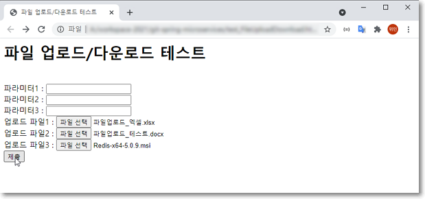  

- 테스트 결과<br/>
    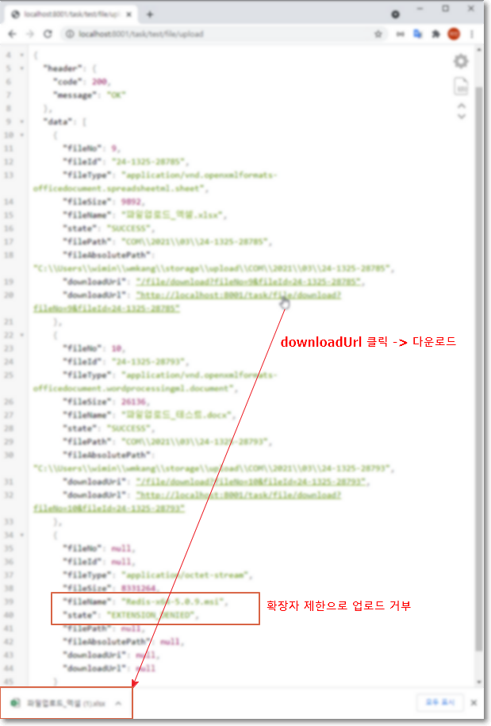<br/>

- 데이터베이스<br/>
    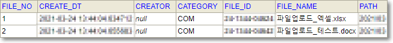
  
- 업로드된 파일<br/>
    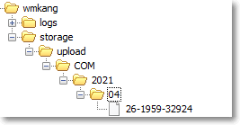
  
- 관련 설정
  - accept-extensions, deny-extensions 옵션 선택적으로 적용 가능
  - 중복 적용된 경우, deny-extensions 우선 적용
  ```yaml
  app:
    file:
      upload:
        base-path: ${user.home}/wmkang/storage/upload
        subdir-format: 'yyyy/MM'
        file-name-format: 'dd-HHmm-ssSSS'
        accept-extensions: ',zip,pdf,rtf,doc,docx,xls,xlsx,ppt,pptx,txt,yaml,yml,jpg,png,'
        deny-extensions: ',exe,bat,cmd,sh,jar,NONE,'
  ```
- 관련 클래스들
  - base-domain
    - wmkang.domain.enums.FileCategory : 업로드 업무 구분용 enum
    - wmkang.domain.service.entity.UploadFile
    - wmkang.domain.service.repository.UploadFileRepository
  - base-common    
    - wmkang.common.file.FileUploadHandler : 파일 업로드 공통 컴포넌트
    - wmkang.common.controller.FileDownloadController : 파일 다운로드 공용 컨트롤러
  - svc-task
    - wmkang.task.test.FileUploadTestController : 해당 기능 테스트를 위한 컨트롤러  

### 5.2 DB 백업/복원
- 초기 화면<br/>
    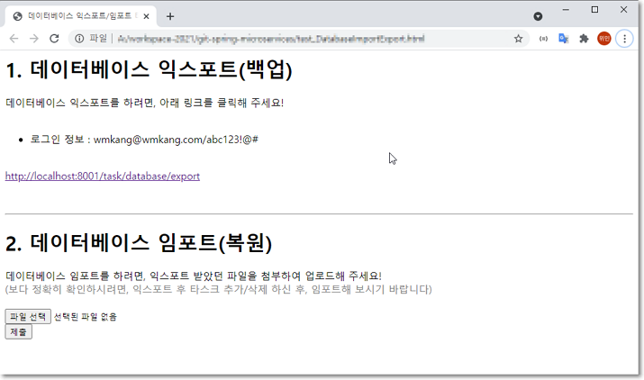
  
- 관련 클래스들
  - svc-task
    - wmkang.task.config.DatabaseProperties 
    - wmkang.task.controller.DatabaseController
--- 
## 6. Spring Cloud 환경 구성

### 6.1 Config 구성
- Maven 프로파일 및 프로퍼티 정의
  - 루트 pom.xml
    - 전체 서비스 뼈대를 잡아주는 설정 정보들이 루트 pom.xml 파일 프로퍼티로 정의되어 있으며, 배포 환경에 맞춰 프로파일로 구분되어 있습니다.
    - 그 외, 세부적인 설정 정보들은 cloud-config 에서 관리되고 있습니다.
    ```xml
    <profiles>
        <profile>
            <id>local</id>
            <activation>
                <activeByDefault>true</activeByDefault>
            </activation>
            <properties>
                <profile>local</profile>
                <label>develop</label>
                <spring.cloud.config.server.git.uri>classpath:/cfg-repo/</spring.cloud.config.server.git.uri>
                <spring.cloud.config.uri>http://localhost:9001</spring.cloud.config.uri>
                <docker.registry>wmkang</docker.registry>
            </properties>
        </profile>
        <profile>
            <id>test</id>
            <properties>
                <profile>test</profile>
                <label>develop</label>
                <spring.cloud.config.server.git.uri>classpath:/cfg-repo/</spring.cloud.config.server.git.uri>
                <spring.cloud.config.uri>http://localhost:9001</spring.cloud.config.uri>
                <docker.registry>wmkang</docker.registry>
            </properties>
        </profile>
        <profile>
            <id>develop</id>
            <properties>
                <profile>develop</profile>
                <label>develop</label>
                <spring.cloud.config.server.git.uri>classpath:/cfg-repo/</spring.cloud.config.server.git.uri>
                <spring.cloud.config.uri>http://cloud-config:9001</spring.cloud.config.uri>
                <docker.registry>wmkang</docker.registry>
            </properties>
        </profile>
        <profile>
            <id>release</id>
            <properties>
                <profile>release</profile>
                <label>master</label>
                <spring.cloud.config.server.git.uri>classpath:/cfg-repo/</spring.cloud.config.server.git.uri>
                <spring.cloud.config.uri>http://cloud-config:9001</spring.cloud.config.uri>
                <docker.registry>asia.gcr.io/magnetic-tenure-269711</docker.registry>
            </properties>
        </profile>
    </profiles>
    ```
- Spring Boot 로컬 설정 파일 - resources/bootstrap.yml
  - 아래 설정 파일 내용과 같이, 대부분의 설정 내용들이 심볼 문자로 구성되어 있습니다. 
  - 각 심볼 문자들은 Maven 프로파일, 프로퍼티, 필터 3가지 기능 조합으로, 빌드 시점에 자동 완성되는 체계입니다.
    - @???@ 값들이 빌드 시점 Maven 프로퍼티 값으로 교체
  - 따라서, Maven 프로파일에 의해 선택된 프로퍼티들이 Spring 프로파일 및 프로퍼티로 자연스럽게 이어지게 됩니다.    
  - 필요한 모든 값들이 Maven으로부터 전달되므로, 각 Boot 모듈들의 bootstrap.yml 설정 파일이 동일합니다.
    - 따라서, 신규 모듈 생성시 단순 파일 복사로 대응 가능합니다.
  - 루트 pom.xml 설정이, 각 자식 모듈로 전파되므로, 루트 설정 변경만으로 모든 모듈에 일괄 적용할 수 있습니다.
    - 단, artifactId 등은 개별 모듈 pom.xml 참조
    ```yaml
    info:
      app:
        name: '@project.artifactId@'
        description: '@project.description@'
        version: '@project.version@'
    
    server:
      servlet:
        context-path: ${app.path.@project.artifactId@}
      port: ${app.port.@project.artifactId@}
    
    spring:
      application:
        name: '@project.artifactId@'
      profiles:
        active: '@profile@'
      cloud:
        config:
          uri: '@spring.cloud.config.uri@'
          label: '@label@'
    ```
  
- 각 Spring Boot 모듈들은 크게 다음 2가지 종류의 설정 파일의 조합으로 실행할 환경 정보를 참조하게 됩니다.
  - 로컬 설정 파일 : resources/bootstrap.yml
  - cloud-config 설정 파일 _(중앙집중식 관리)_
    - cloud-config 모듈은 설정 파일들을 관리하는 저장소를 참조하고 있으며, Boot 모듈들이 필요로 하는 정보를 이 저장소 파일을 참조하여 내려주게 됩니다.  
    - cloud-config 서버가 참조하는 저장소는 별도로 운영되는 Git 서버를 참조하도록 해야 하나, 편의상 config-server 내 resource/cfg-repo 폴더를 이용하도록 하였습니다.
    - 설정값의 변경을 실시간 적용하기 위해 Spring Cloud Bus를 구성해야 하나, 전체 시스템 구성의 복잡도를 낮추기 위해 생략하였습니다.
- 설정 파일 용도 구분
  - bootstrap.yml : cloud-config 서버 접속 정보 및 cloud-config에 전달할 자신의 식별자 정보만 포함합니다.
  - Config 저장소 설정 파일 : 서비스 구동에 필요한 대부분의 설정 값들을 관리합니다.
  
- Config 저장소 설정 파일들 <br/>
  &nbsp;&nbsp;  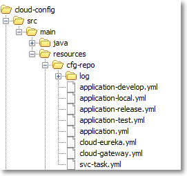
  - 전체 애플리케이션 공통 설정 파일
    - appplication.yml
    - appplication-${profile}.yml : 배포 환경에 맞춰 조정되어야 하는 항목 값들을 프로파일별로 파일을 구분하여 관리합니다.
    - 위 파일들의 설정값은 전체 모듈에 적용되므로, 수정 시, 모든 서비스에 영향을 미치게 됩니다.
  - 개별 애플리케이션 설정 파일
    - cloud-eureka.yml, cloud-gateway.yml, svc-task.yml 등
    - 개별 애플리케이션 단위 프로파일 설정 정보는, 구분자를 사용하여 하나의 파일에서 모두 관리하도록 되어 있습니다.
    ```yaml
    app:
      task:
        database:
          import-path: ./h2/import
          export-path: ./h2/export
          export-file: ${app.task.database.export-path}/TASK_DUMP_
          drop-query: DROP ALL OBJECTS
          
    ---
    spring:
      profiles: local
    
    ---
    spring:
      profiles: test
    ```


### 6.2 Logging 구성
- resources/bootstrap.yml
  - Config 구성에서와 같이, 빌드 시점 Maven 프로퍼티로 교체되어, 실제 적용될 값이 완성되는 구조로, Boot 로그 설정이 되어 있습니다.
  - 실질적인 설정은 cloud-config 서버로 부터 조회된 정보를 기반으로 로그 환경 구성이 이루어지게 됩니다.
  
  ```yaml  
  logging:
    config: '@spring.cloud.config.uri@/@project.artifactId@/@profile@/@label@/log/@project.artifactId@-logback.xml'
  ```
- Config 저장소 로그 설정 파일들 <br/>
&nbsp;&nbsp;&nbsp; 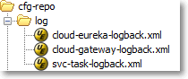
  
  - 설정 파일 구성
    - 아래 예와 같이, Logback 설정 파일은, Spring 프로퍼티를 참조하여, 로그 경로 및 파일명이 자동 완성하도록 구성되어 있습니다.
    - 즉, Maven 프로파일 및 프로퍼티가 Spring 프로파일 및 프로퍼티로 이어지고, 그것이 다시 Logback 설정으로 이어지는 구조입니다.
    - 따라서, pom.xml 파일 외, 어느 곳에서도 애플리케이션 이름 등을 수동 입력하는 부분이 없습니다. 
  ```xml
  <configuration>
  
      <springProperty name="appName"       source="spring.application.name"  defaultValue="svc-no-name" />
      <springProperty name="logBaseDir"    source="app.log-base-path"        defaultValue="${user.home}/logs" />
  
      <property name="CONSOLE_LOG_PATTERN" value="%d{HH:mm:ss} %clr(%-5p) %clr([%-40.40C{39}.%-20.-20M:%4L]){blue} %m%n%wEx" />
      <property name="FILE_LOG_PATTERN"    value="%d{HH:mm:ss.SSS} %-5p [%t] %-40.40C{39}:%4L - %m%n%wEx" />
  
      <property name="BASIC_FILE"          value="${logBaseDir}/${appName}/basic-${appName}.log" />
      <property name="ERROR_FILE"          value="${logBaseDir}/${appName}/error-${appName}.log" />
  
      <property name="BASIC_ROLLING_FILE"  value="${logBaseDir}/${appName}/%d{yyyyMMdd}-basic-%i-${appName}.log" />
      <property name="ERROR_ROLLING_FILE"  value="${logBaseDir}/${appName}/%d{yyyyMMdd}-error-%i-${appName}.log" />
    
  </configuration>
  ```
- 자체 Logback Filter 적용
  - 별도의 필터 클래스를 정의하며, 불필요한 로그 출력을 줄이도록 하였습니다.
    - 아래 예에서 등록된 ApplicationException은 애플리케이션 논리적 오류 상황을 표현하기 위해 자체 정의한 예외 클래스입니다. 
  ```xml
  <appender name="ERROR_APPENDER" class="ch.qos.logback.core.rolling.RollingFileAppender" >
      ~~~
      <filter class="wmkang.common.logback.LogbackFilter">
          <excludeClassList>wmkang.common.exception.ApplicationException|</excludeClassList>
      </filter>
  </appender>
  ```
- 컨테이너 기반  실행 환경을 고려했을 때, ELK 등 로그 수집 체계를 이용해야 하나, 편의상 로컬 로깅 방식을 사용하도록 하였습니다.


---
## 7. 확장형 데이터베이스 설계
### 7.1 DataSource 구성

```yaml
  datasource:
    hikari:
      driver-class-name: org.h2.Driver
      connection-test-query: SELECT 1
      connection-timeout: 3000   
      minimum-idle: 1            
      maximum-pool-size: 3       
      idle-timeout: 10000        
      max-lifetime: 30000        
      manage:
        pool-name: CP-MANAGE
        driver-class-name: ${spring.datasource.hikari.driver-class-name}
        username: ${spring.datasource.hikari.username}
        password: ${spring.datasource.hikari.password}
        connection-test-query: ${spring.datasource.hikari.connection-test-query}
        connection-timeout: ${spring.datasource.hikari.connection-timeout}
        minimum-idle: ${spring.datasource.hikari.minimum-idle}
        maximum-pool-size: ${spring.datasource.hikari.maximum-pool-size}
        idle-timeout: ${spring.datasource.hikari.idle-timeout}
        max-lifetime: ${spring.datasource.hikari.max-lifetime}
      service-1:
        pool-name: CP-SERVICE-1
        driver-class-name: ${spring.datasource.hikari.driver-class-name}
        username: ${spring.datasource.hikari.username}
        password: ${spring.datasource.hikari.password}
        connection-test-query: ${spring.datasource.hikari.connection-test-query}
        connection-timeout: ${spring.datasource.hikari.connection-timeout}
        minimum-idle: ${spring.datasource.hikari.minimum-idle}
        maximum-pool-size: ${spring.datasource.hikari.maximum-pool-size}
        idle-timeout: ${spring.datasource.hikari.idle-timeout}
        max-lifetime: ${spring.datasource.hikari.max-lifetime}
      service-2:
        pool-name: CP-SERVICE-2
        driver-class-name: ${spring.datasource.hikari.driver-class-name}
        username: ${spring.datasource.hikari.username}
        password: ${spring.datasource.hikari.password}
        connection-test-query: ${spring.datasource.hikari.connection-test-query}
        connection-timeout: ${spring.datasource.hikari.connection-timeout}
        minimum-idle: ${spring.datasource.hikari.minimum-idle}
        maximum-pool-size: ${spring.datasource.hikari.maximum-pool-size}
        idle-timeout: ${spring.datasource.hikari.idle-timeout}
        max-lifetime: ${spring.datasource.hikari.max-lifetime}
```
- 총 3개의 Datasource가 구성되어 있지만, 실제 2가지 종류(CP-MANAGE, CP-SERVICE)로 구성되어 있다고 보시면 되겠습니다.
- CP-SERVICE : 실제 서비스에 필요한 데이터를 관리하는 용도이며, 트래픽/사용자 증가 또는 멀티테넌트 환경에서 고객사별 물리적 분할 공간을 제공해야 하는 상황 등, 
  요건에 맞춰 DB의 확장이 필요한 상황이라 가정하여, CP-SERVICE-1, CP-SERVICE-2 로 늘어날 수 있도록 구성되어 있습니다.
- CP-MANAGE : 기본적으로 사용자 로그인 정보를 관리하며, 추가적으로 사용자/고객사별로 어느 SERVICE DB(CP-SERVICE-1, CP-SERVICE-2...)를 사용하도록 할 것인지 구분 정보를 관리하기 위한 용도입니다.  
- CP-SERVICE-1, CP-SERVICE-2,,, : 개별 Datasource 객체로 운영되지만, 아래 환경설정과 같이 모든 Service 데이터소스들은 
  ShardDataSource 라는 하나의 Datasource에 등록되고, ShardDataSource에 의해 런타임시 어떤 데이터소스가 사용될 것인지 결정되게 됩니다.
```java
    @Bean
    @ConfigurationProperties(prefix = "spring.datasource.hikari.service-1")
    public DataSource dataSource1(){
        return DataSourceBuilder.create().type(HikariDataSource.class).build();
    }

    @Bean
    @ConfigurationProperties(prefix = "spring.datasource.hikari.service-2")
    public DataSource dataSource2(){
        return DataSourceBuilder.create().type(HikariDataSource.class).build();
    }    

    @Bean
    public DataSource serviceDataSource() {
    
        Map<Object, Object> dataSourceMap = new HashMap<>();
        dataSourceMap.put("1", dataSource1());
        dataSourceMap.put("2", dataSource2());
    
        ShardDataSource shardDataSource = new ShardDataSource();
        shardDataSource.setName("SERVICE-DATASOURCE");
        shardDataSource.setTargetDataSources(dataSourceMap);
        shardDataSource.afterPropertiesSet();
    
        // JPA 테이블 생성을 위해, 임시로 디폴트 DataSource 지정
        shardDataSource.setDefaultTargetDataSource(dataSourceMap.get("1"));
        return shardDataSource;
    }
```
- ShardDataSource는 Spring AbstractRoutingDataSource를 상속받고 있으며, 오버라이드된 메소드에 런타임시 어떤 Datasouce가 선택되도록 할 것인지 선택 로직이 포함되어 있습니다.
- 선택 로직은 2가지 기준으로 적용되어 있습니다.
  - 1차 기준 : ShardHolder.get() 메소드 조회 값으로 선택 기준을 판별
  - 2차 기준 : 로그인 사용자 세션 정보에 저장되어 있는 샤드 정보를 기준으로 데이터소스 선택
  - 2차 선택 기준인, 사용자 세션 정보는 CP-MANAGE에서 관리되는 사용자/고객사별 SERVICE DB 선택 기준이 적용되도록 한 것입니다.
  - 2차 선택 기준만으로 충분한 것으로 보일 수 있으나, 관리자 등은 샤드를 옮겨가며 조회해야 할 필요가 있을 것이므로, 1차 선택 기준을 추가하였습니다.
```java
public class ShardDataSource extends AbstractRoutingDataSource {

    private String name = "NO_NAME";

    @Override
    protected Object determineCurrentLookupKey() {
        String shardNo = ShardHolder.get();
        if (shardNo == null) {
            Authentication authentication = SecurityContextHolder.getContext().getAuthentication();
            if ((authentication != null) && !(authentication instanceof AnonymousAuthenticationToken))
                shardNo = ((UserDetails) authentication.getPrincipal()).getShard().getNo();
        }
        log.trace("# SHARD_CHOICE - {}", shardNo);
        return shardNo;
    }

    public void setName(String name) {
        this.name = name;
    }

    @Override
    public String toString() {
        return "ShardDataSource." + name;
    }
}
```
- 1차 선택 기준은 예약된 특정 파라미터 값 기준으로 Request 단위로 적용되는 방법입니다.
- 아래 코드와 같이, Shard 라는 enum 타입이 정의되어 있으며, 정의된 각각의 값(FIRST, SECOND)은 CP-SERVICE-1, CP-SERVICE-2와 매핑됩니다.
```java
@AllArgsConstructor
public enum Shard implements Symbolic {

    FIRST   ("1"),
    SECOND  ("2");

    private final String shardNo;

    public String getNo() {
        return shardNo;
    }

    @Override
    public String getSymbol() {
        return shardNo;
    }

    @JsonCreator
    public static Shard fromJson(String jsonValue) {
        for (Shard shard : values()) {
            if (shard.getNo().equals(jsonValue)) {
                ShardHolder.set(shard.getNo());
                return shard;
            }
        }
        throw new IllegalArgumentException(jsonValue);
    }
}
```
```java
@Converter(autoApply = true)
public class ShardConverter extends AbstractSymbolicConverter<Shard> {

    @Override
    public Shard convert(String shardNo) {
        Shard shard = super.convert(shardNo);
        if(shard != null) {
            ShardHolder.set(shardNo);
        }
        return shard;
    }
}
```
- Controller 파라미터로 Shard 타입 변수를 선언하거나, DTO 속성으로 Shard 타입을 추가하는 경우,
  HTTP 파라미터 또는 Json 요청 정보가 Shard 타입으로 변환되었을 때, 변환된 값이 ShardHolder에 의해 ThreadLocal에 저장되게 됩니다.
- 이렇게 저장된 값은, 앞서 살펴 본 ShardDataSource의 1차 선택 기준으로 적용됩니다.  
  
```java
public class ShardHolder {

    private static final ThreadLocal<String> currentShard = new ThreadLocal<>();

    public static void set(String shardNo) {
        log.trace("> ShardHolder.set(" + shardNo + ")");
        currentShard.set(shardNo);
    }

    public static void set(Integer shardNo) {
        log.trace("> ShardHolder.set("+shardNo+")");
        currentShard.set(String.valueOf(shardNo));
    }

    public static void remove() {
        log.trace("> ShardHolder.remove()");
        currentShard.remove();
    }

    public static String get() {
        return currentShard.get();
    }
}
```
- 컨테이너가 HTTP 요청 처리를 위해 쓰레드 Pool을 운영할 수 있으므로, 쓰레드에 설정된 샤드값이 원하지 않는 시점에 작용할 가능성이 남아 있습니다.
- 이런 잠재적 문제를 피하기 위해, ControllerAdvice를 통해 Controller 처리가 끝나는 즉시, ShardHolder를 통해 쓰레드 변수값을 지우도록 조치하였습니다.
  - ControllerAdvice 본연의 용도는 자체 정의한 응답코드를 HTTP 상태코드와 동일하게 맞춰주는 것이며, 이와 더불어 부가적인 조치를 추가한 것입니다.
```java
@Aspect
@Component
public class ControllerAdvice {

    @AfterReturning(pointcut = C.AOP_POINTCUT_EXPR_CONTROLLER, returning = "response")
    public void handleHttpStatus(JoinPoint joinPoint, Response<?> response) {
        if ((response != null) && (response.getHeader() != Status.SUCCESS)) {
            try {
                HttpServletResponse httpResponse = ((ServletRequestAttributes) RequestContextHolder.currentRequestAttributes()).getResponse();
                httpResponse.setStatus(response.getHeader().getCode());
            } catch (Exception e) {
            }
        }
        ShardHolder.remove();
    }
}
```
예외 발생 상황을 감안하여, ExceptionHandlerAdvice에 대해서도 동일한 조치를 적용하였습니다.

```java
@Aspect
@Component
public class ExceptionHandlerPostAdvice {

    @AfterReturning(pointcut = "execution(wmkang.common.api.Response wmkang.common.aop.ExceptionHandlerAdvice.*(..))", returning = "response")
    public void handleHttpStatus(JoinPoint joinPoint, Response<?> response) {
        HttpServletResponse httpResponse = ((ServletRequestAttributes) RequestContextHolder.currentRequestAttributes()).getResponse();
        httpResponse.setStatus(response.getHeader().getCode());
        ShardHolder.remove();
    }
}
```

### 7.2 JPA 구성

- base-common 모듈 wmkang.common.config 패키지에 Spring Boot Config 클래스들이 배치되어 있습니다.
- 그 중 DatasourceManageConfig, DatasourceServiceConfig 에 Datasoruce 및 JPA EntityManger, TransactionManager, Querydsl Factory 설정이 포함되어 있습니다.
- 동일한 유형의 빈 객체가 manager, service 각각 필요하므로, 이들을 식별할 수 있도록 빈 이름 접두어로 manage, service를 사용하였고, 이 이름을 사용하여 관련 객체들을 초기화 하였습니다.
```java
@EnableJpaAuditing(auditorAwareRef = "auditorProvider")
@EnableJpaRepositories(
    basePackages            = "wmkang.domain.manage.repository",
    entityManagerFactoryRef = "manageEntityManager",
    transactionManagerRef   = "manageTransactionManager"
)
@Configuration
public class DatasourceManageConfig {

    public static final String ENTITY_BASE_PACKAGE = "wmkang.domain.manage.entity";
    public static final String ENUM_BASE_PACKAGE   = "wmkang.domain.enums";

    @Bean
    @ConfigurationProperties(prefix = "spring.jpa.properties")
    public Map<String, String> jpaProperties(){
        return new HashMap<>();
    }

    @Primary
    @Bean
    @ConfigurationProperties(prefix = "spring.datasource.hikari.manage")
    public DataSource manageDataSource(){
        return DataSourceBuilder.create().type(HikariDataSource.class).build();
    }

    public static HibernateJpaVendorAdapter getJpaVendorAdapter() {
        HibernateJpaVendorAdapter jpaVendorAdapter = new HibernateJpaVendorAdapter();
        jpaVendorAdapter.setDatabase(Database.H2);
        return jpaVendorAdapter;
    }

    @Bean
    public LocalContainerEntityManagerFactoryBean manageEntityManager() {
        LocalContainerEntityManagerFactoryBean entityManagerFactoryBean = new LocalContainerEntityManagerFactoryBean();
        entityManagerFactoryBean.setPersistenceUnitName("manage");
        entityManagerFactoryBean.setDataSource(manageDataSource());
        entityManagerFactoryBean.setJpaVendorAdapter(getJpaVendorAdapter());
        entityManagerFactoryBean.setPackagesToScan(ENTITY_BASE_PACKAGE, ENUM_BASE_PACKAGE);
        entityManagerFactoryBean.setJpaPropertyMap(jpaProperties());
        return entityManagerFactoryBean;
    }

    @Bean
    public PlatformTransactionManager manageTransactionManager() {
        JpaTransactionManager transactionManager = new JpaTransactionManager();
        transactionManager.setEntityManagerFactory(manageEntityManager().getObject());
        return transactionManager;
    }

    /**
     * querydsl-jpa 모듈 초기화
     */
    @Bean
    public JPAQueryFactory manageJPAQueryFactory(@Qualifier("manageEntityManager") EntityManager manageEntityManager) {
        return new JPAQueryFactory(manageEntityManager);
    }

    /**
     * querydsl-sql 모듈 초기화
     */
    @Bean
    public SQLTemplates sqlTemplates() {
        return new H2Templates();
    }

    @Bean
    public com.querydsl.sql.Configuration querydslSqlConfiguration() {
        com.querydsl.sql.Configuration configuration = new com.querydsl.sql.Configuration(sqlTemplates());
        configuration.setExceptionTranslator(new SpringExceptionTranslator());
        return configuration;
    }

    @Bean
    public SQLQueryFactory manageSQLQueryFactory() {
        return new SQLQueryFactory(querydslSqlConfiguration(), new SpringConnectionProvider(manageDataSource()));
    }
}
```
- DatasourceManageConfig와 동일 패턴으로 DatasourceServiceConfig도 구성되어 있으며, 
  추가적으로 manage, service 2개 데이터소스 간 통합 트랜잭션 지원을 위해, ChainedTransactionManager를 사용한 globalTransactionManager가 하나 더 추가되어 있습니다. 
```java
    /**
     * manage & service 통합 트랜잭션
     */
    @Primary
    @Bean
    public PlatformTransactionManager globalTransactionManager(PlatformTransactionManager manageTransactionManager, PlatformTransactionManager serviceTransactionManager) {
        return new ChainedTransactionManager(manageTransactionManager, serviceTransactionManager);
    }
```
- DB 핸들링을 위해 Querydsl을 주로 사용한다고 가정하고, Querydsl 작성을 보다 더 간결하게 지원하기 위해 AbstractCommonRepository라는 Repository 모델을 정의해 보았습니다.

```java
public abstract class AbstractCommonRepository extends QuerydslRepositorySupport {

  protected JPAQueryFactory jpaQueryFactory;
  protected SQLQueryFactory sqlQueryFactory;
  protected SQLTemplates    sqlTemplates;

  public AbstractCommonRepository(Class<?> domainClass) {
    super(domainClass);
  }

  // 1. JPAQuery

  protected JPAQuery<Tuple> select(Expression<?>... exprs) {
    return jpaQueryFactory.select(exprs);
  }

  protected <T> JPAQuery<T> select(Expression<T> expr) {
    return jpaQueryFactory.select(expr);
  }

  protected <T> JPAQuery<T> selectDistinct(Expression<T> expr) {
    return jpaQueryFactory.selectDistinct(expr);
  }

  protected JPAQuery<Tuple> selectDistinct(Expression<?>... exprs) {
    return jpaQueryFactory.selectDistinct(exprs);
  }

  protected JPAQuery<Integer> selectOne() {
    return jpaQueryFactory.selectOne();
  }

  protected JPAQuery<Integer> selectZero() {
    return jpaQueryFactory.selectZero();
  }

  protected <T> JPAQuery<T> selectFrom(EntityPath<T> from) {
    return jpaQueryFactory.selectFrom(from);
  }

/*  
    // QuerydslRepositorySupport 메소드와 중복

    protected JPAQuery<?> from(EntityPath<?> from) {
        return jpaQueryFactory.from(from);
    }

    protected JPAQuery<?> from(EntityPath<?>... from) {
        return jpaQueryFactory.from(from);
    }
*/

  protected JPAQuery<?> getJPAQuery() {
    return jpaQueryFactory.query();
  }

  // 2. SQLQuery

  protected SQLQuery<?> getSQLQuery() {
    return sqlQueryFactory.query();
  }

  // 3. JPASQLQuery

  protected <T> JPASQLQuery<T> getJPASQLQuery(Class<T> clazz) {
    return new JPASQLQuery<T>(getEntityManager(), sqlTemplates);
  }
}
```
- 이를 manage, service 데이터소스에 맞춰 처리할 수 있도록 AbstractManageRepository, AbstractServiceRepository 클래스를 추가하였습니다.
```java
public abstract class AbstractManageRepository extends AbstractCommonRepository {

    public AbstractManageRepository(Class<?> domainClass) {
        super(domainClass);
    }

    @Override
    @PersistenceContext(unitName = "manageEntityManager")
    public void setEntityManager(EntityManager entityManager) {
        super.setEntityManager(entityManager);
    }

    @Autowired
    public final void init(JPAQueryFactory manageJPAQueryFactory, SQLQueryFactory manageSQLQueryFactory, SQLTemplates template) {
        jpaQueryFactory = manageJPAQueryFactory;
        sqlQueryFactory = manageSQLQueryFactory;
        sqlTemplates = template;
    }
}
```
- 다음은 이를 실제 기능 구현에 적용한 사례입니다.
- 하나의 저장소 개발을 위해 별도의 인터페이스 및 클래스가 필요한 관계로, 너무 많은 클래스 파일들이 생성되는 것을 방지하기 위한 단일 Java 파일에 Inner Class로 한꺼번에 정의하였습니다. 
```java
@Repository
public interface TaskRepository extends JpaRepository<Task, Integer>,
                                        QuerydslPredicateExecutor<Task>,
                                        TaskRepositoryExtend {

    List<Task> findByIdIn(List<Integer> idList);
    Page<Task> findByTitleIgnoreCaseContainsAndCompletedAndCreatedDateAfter(String title, Boolean completed, LocalDateTime createdDate, Pageable pageable);
}


// Extend
interface TaskRepositoryExtend {
}


// ExtendImpl
class TaskRepositoryExtendImpl 	extends    AbstractServiceRepository
                                implements TaskRepositoryExtend {

    public TaskRepositoryExtendImpl() {
        super(Task.class);
    }
}
```

### 7.3 트랜잭션 처리
- 트랜잭션 처리를 위해 @Transactional을 사용해야 하나, 다수의 속성값들을 설정해야 하고, 
  또 Datasource가 분할되어 있어 실수할 가능성이 높다고 판단하여, 아래와 같은 어노테이션을 별도로 정의하였습니다.
  
```java
@Target({ ElementType.METHOD, ElementType.TYPE })
@Retention(RetentionPolicy.RUNTIME)
@Transactional( transactionManager = C.TX_MANAGER_MANAGE,
                readOnly = false,
                propagation = Propagation.REQUIRED,
                isolation = Isolation.READ_COMMITTED,
                timeout = C.TX_TIMEOUT_SECONDS,
                rollbackFor = Throwable.class)
public @interface ManageWriteTransactional {
}
```
- 같은 패턴으로 총 6개의 자체 Transactional을 정의하였습니다.
  - ManageReadTransactional
  - ManageWriteTransactional
  - ServiceReadTransactional
  - ServiceWriteTransactional
  - GlobalReadTransactional
  - GlobalWriteTransactional
- 다음은 자체 정의한 Transactional을 적용한 에제 코드입니다.
```java 
    @PostMapping
    @ServiceWriteTransactional
    public Response<Integer> create(@Valid @RequestBody CreateTask taskDto) {
    }
```

---
## 8. 감사
### 8.1 엔티티 감사
- 각 엔티티 대상으로 추가/변경 시점 및 생성/수정자를 추적할 수 있도록, 다음 2개의 AuditingEntityListener를 추가하였습니다.
- 아래 2번째 추가한 CreateAuditable은 수정이 일어나지 않는, 히스토리성 데이터를 위해 추가한 것입니다.
```java
@Getter
@MappedSuperclass
@EntityListeners(AuditingEntityListener.class)
public abstract class Auditable {

    @CreatedDate
    @Column(name = "CREATE_DT", updatable = false)
    protected LocalDateTime createdDate;

    @CreatedBy
    @Column(name = "CREATOR", updatable = false)
    protected Integer creator;

    @LastModifiedDate
    @Column(name = "MODIFY_DT")
    protected LocalDateTime modifiedDate;

    @LastModifiedBy
    @Column(name = "MODIFIER")
    protected Integer modifier;
}
```
```java
@Getter
@MappedSuperclass
@EntityListeners(AuditingEntityListener.class)
public abstract class CreateAuditable {

    @CreatedDate
    @Column(name = "CREATE_DT", updatable = false)
    protected LocalDateTime createdDate;

    @CreatedBy
    @Column(name = "CREATOR", updatable = false)
    protected Integer creator;
}
```
이와 더불어 생성자/수정자를 찾을 수 있도록, AuditorAware 빈을 정의하였습니다.
```java
    @Bean
    public AuditorAware<Integer> auditorProvider() {
        return () -> {
            Authentication authentication = SecurityContextHolder.getContext().getAuthentication();
            if ((authentication == null) || (authentication instanceof AnonymousAuthenticationToken))
                return Optional.empty();
            return Optional.of(((UserDetails) authentication.getPrincipal()).getId());
        };
    }
```

### 8.2 감사 로그
- 엔티티 단위 감사로는 변경 이력을 추적에 한계가 있어, 감사 로그 기능을 추가하였습니다.
- 감사 로그 기능을 위해, 다음과 같은 클래스들이 추가되어 있습니다.
  - AuditLog : 감사 로그가 필요한 메소드들을 마킹하기 위한 어노테이션
  - ActionType : AuditLog가 적용된 메소드에서 처리하는 기능 구분
  - AuditLogAdvice : AuditLog가 적용된 메소드를 식별하여, 메소드 실행 후 감사 로그를 기록하는 기능
  - AuditHistory : 감사 로그 테이블에 해당하는 엔티티
  - AuditHistoryRepository : AuditHistory 엔티티에 대한 Repository
  
```java
@AllArgsConstructor
public enum ActionType implements Symbolic {

    CREATE ("C"),
    READ   ("R"),
    UPDATE ("U"),
    DELETE ("D");

    private String symbol;

    @Override
    public String getSymbol() {
        return symbol;
    }
}
```
```java
@Target({ElementType.METHOD})
@Retention(RetentionPolicy.RUNTIME)
public @interface AuditLog {

    String id();
    ActionType action();
}
```
```java
@RequiredArgsConstructor
@Aspect
@Component
public class AuditLogAdvice {

    @Value("${app.audit.enable}")
    private boolean auditEnabled;

    @Autowired
    private ObjectMapper objectMapper;

    @Autowired
    private AuditHistoryRepository auditHsitoryRepo;

    @PostConstruct
    public void init(){
        objectMapper = objectMapper.copy();
        objectMapper.setSerializationInclusion(JsonInclude.Include.NON_EMPTY);
    }

    @AfterReturning(pointcut = C.AOP_POINTCUT_EXPR_CONTROLLER + "&& @annotation(auditLog)", returning = "response")
    public void processAudit(JoinPoint joinPoint, Response<?> response, AuditLog auditLog) {
        if ((!auditEnabled) || (response == null) || (response.getHeader() != Status.SUCCESS)) {
            return;
        }
        MethodSignature methodSignature = (MethodSignature) joinPoint.getSignature();
        String[] paramNames = methodSignature.getParameterNames();
        Object[] paramValues = joinPoint.getArgs();
        Map<String, Object> paramMap = new HashMap<>();
        for (int i = 0; i < paramValues.length; i++) {
            if (paramValues[i].getClass().getName().startsWith("javax"))
                continue;
            paramMap.put(paramNames[i], paramValues[i]);
        }
        String paramJsonStr = null;
        try {
            paramJsonStr = objectMapper.writeValueAsString(paramMap);
        } catch (Exception e) {
            paramJsonStr = "Parameters serialization failed";
        }
        AuditHistory history = AuditHistory.builder().api(auditLog.id())
                                                     .action(auditLog.action())
                                                     .args(paramJsonStr)
                                                     .actor(Util.getLoginUser().getId())
                                                     .time(LocalDateTime.now())
                                                     .build();
        auditHsitoryRepo.save(history);
    }
}
```
```java
@Builder
@ToString
@Getter
@EqualsAndHashCode(of = { "seqNo" })
@Table(name = "AUDIT_HISTORY")
@Entity
public class AuditHistory {

    /** 순번 */
    @GeneratedValue(strategy = GenerationType.IDENTITY)
    @Id
    @Column(name = "SEQ_NO")
    private Long       seqNo;

    /** API 아이디 */
    @Column(name = "API")
    private String     api;

    /** 액션타입 */
    @Column(name = "ACTION", columnDefinition = "char(1)")
    private ActionType action;

    /** API 파라미터 */
    @Column(name = "ARGS", columnDefinition = "text")
    private String     args;

    /** 행위자 아이디 */
    @Column(name = "ACTOR")
    private Integer    actor;

    /** 발생시간 */
    @Column(name = "TIME")
    LocalDateTime      time;
}

```
다음은 위 AudiLog 어노테이션이 적용된 예입니다.
```java
    @AuditLog(id = "T02", action = ActionType.UPDATE)
    @PutMapping("/{id}")
    @ServiceWriteTransactional
    public Response<Void> update(@PathVariable Integer id, @RequestBody @Valid UpdateTask taskDto){
    }
```
- @AuditLog의 id 속성값은 각 API에 대한 식별 코드 입니다.
- 실제 유용한 감사 정보를 제공하기 위해 추가적인 테이블 정의가 필요하며, 그 테이블에는 다음과 같은 기초 데이타 정의가 필요합니다.
  - API ID
  - 메뉴 경로
  - API 설명
- 사용자에게 감사 로그 정보를 제공할 때에는, 감사이력 테이블(AUDIT_HISTORY)와 기초 데이터 테이블을 조인하여 보다 풍부한 정보를 제공할 수 있습니다.

---
## 9. 캐쉬
- Redis 기반의 캐쉬 기능을 이용할 때, HashOperations을 주로 사용한다고 가정하였습니다.
- HashOperations 사용시 불편함(2개의 Key 사용)을 덜기 위해, 다음 2개의 범용 클래스를 추가하였습니다.
  - Cache : HashOperations의 1차 키를 어노테이션으로 구분하기 위한 용도
  - RedisCacheTemplate : Cache에 적용된 1차 키를 기반으로 HashOperations의 1차 키가 생략된 단순화된 메소드 제공
```java
@Target({ElementType.TYPE})
@Retention(RetentionPolicy.RUNTIME)
@Component
public @interface Cache {

	String value() default "";
}
```
```java
    @Bean
    public RedisTemplate<String, ?> redisTemplate(RedisConnectionFactory redisConnectionFactory) {
        RedisTemplate<String, ?> template = new RedisTemplate<>();
        template.setConnectionFactory(redisConnectionFactory);
        template.setEnableTransactionSupport(true);
        return template;
    }
```
```java
public class RedisCacheTemplate<T> {

    @Resource(name = "redisTemplate")
    private HashOperations<String, String, T> hashOperations;

    private String                            namespace;

    @PostConstruct
    protected void init() {
        namespace = this.getClass().getAnnotation(Cache.class).value();
        if(namespace == null)
            throw new RuntimeException("Cache namespace is not specified - " + this.getClass().getName());
    }

    // HashOperations Wrapping Methods

    public Set<String> keys(){
        return hashOperations.keys(namespace);
    }

    public void putAll(Map<String, T> map) {
        hashOperations.putAll(namespace, map);
    }

    public void put(String key, T value) {
        hashOperations.put(namespace, key, value);
    }

    public T get(String key) {
        return hashOperations.get(namespace, key);
    }

    public List<T> multiGet(Collection<String> keys) {
        return hashOperations.multiGet(namespace, keys);
    }

    public void delete(Object... keys) {
        hashOperations.delete(namespace, keys);
    }

    public void drop() {
        hashOperations.delete(namespace, keys().toArray());
    }
}
```
- 다음은 정의된 2개의 클래스를 공통코드 캐쉬을 위해 적용한 사례입니다.
  - 같은 형태로 @Cache 값("code")을 달리하여, 여러가지 캐쉬 대상을 정의할 수 있습니다.
  - 아래 추가된 get() 메소드는 공통코드 캐쉬 기능에서만 필요한 것이며, 다른 캐쉬에서는 불필요할 수 있습니다. 
```java
@Cache("code")
public class CodeCache extends RedisCacheTemplate<Map<String, String>> {

    @Nullable
    public String get(String groupCode, String code) {
        Map<String, String> map = get(groupCode);
        return (map == null)? null : map.get(code);
    }
}
```
- 공통코드 참조가 필요한 코드에서는 CodeCache 부모인 RedisCacheTemplate에서 정의한 메소드를 사용하여, 
  groupCode 값으로 해당 그룹 내 코드 값들을 조회할 수도 있고, CodeCache에서 자체 정의한 get() 메소드를 사용하여, 그룹내 특정 코드 값만 조회할 수도 있습니다.
- 그리고, DB에 저장되어 있는 값들을 Redis 캐쉬로 신규 로딩 및 재로딩 기능을 구현하기 위해, CacheHandler라는 컴포넌트가 추가되어 있습니다.
```java
@RequiredArgsConstructor
@Component
public class CacheHandler {

    final CodeRepository codeRepo;
    final CodeCache      codeCache;

    public synchronized void reloadCodeCache() {
        
        log.info("# COMMON CODE (RE)LOADING");
        
        Set<String> keySet = codeCache.keys();
        List<Code> codeList = codeRepo.findAllByOrderByGroupCodeAscCodeAsc();

        Map<String, Map<String, String>> resultMap = codeList.stream().collect(
                Collectors.groupingBy(  Code::getGroupCode,
                                        Collectors.toMap(Code::getCode,Code::getName)
        ));
        codeCache.putAll(resultMap);

        // 이전 캐쉬 로딩 시점에 있었던 코드가, 신규 로딩시 삭제되었을 수 있으므로, 해당 코드만 캐쉬에서 제거함.
        if(keySet != null) {
            keySet.removeAll(resultMap.keySet());
            keySet.stream().forEach(codeCache::delete);
        }
    }
}
```  
- CacheHandler를 수동 동작시키는 것이 아니라, 이벤트에 따라 자동 동작되도록 하기 위해, 다음과 같은 설정을 추가하였습니다.
```java
    @EventListener({ ApplicationStartedEvent.class, CodeRefreshEvent.class })
    public void refreshCodes(ApplicationEvent e) {
        cacheHandler.reloadCodeCache();
    }
```
- ApplicationStartedEvent는 스프링 컨테이너 구동 시, 프레임워크에 의해 자동 발생되는 이벤트로서, 초기 로딩 용도이며,
  CodeRefreshEvent는 DB 변경이 있을 시, 필요에 따라 재로딩 하기 위한 용도로 자체 정의한 이벤트 클래스입니다.
```java
public class CodeRefreshEvent extends ApplicationEvent {

    public CodeRefreshEvent(Object source) {
        super(source);
    }
}
```  
- 다음은 CodeRefreshEvent를 발생시키기 위한 용도의 Controller 클래스입니다.
```java
@Hidden
@RequiredArgsConstructor
@RequestMapping("/event")
@RestController
public class EventPublishController {

    private final ApplicationEventPublisher eventPublisher;

    @GetMapping("/code-refresh")
    public Response<Void> refresh() {
        eventPublisher.publishEvent(new CodeRefreshEvent(this));
        return Response.ok();
    }
}
```

---
## 10. util 패키지
- Spring Cloud 인프라 모듈(cloud-config 등)을 제외한 나머지 모듈에는 util이라는 패키지 및
  그 안에 C 라는 인터페이스와 Util 이라는 클래스가 포함되어 있습니다.
  - C : 개별 모듈에서 사용되는 상수 정의
  - Util : 개별 모듈에서 빈번히 사용되는 기능들을 모듈화 하기 위한 유틸리티 클래스
- 모듈간 의존관계는 base-domain, base-common, svc-task 순으로 적용되어 있으며,
  이 의존관계에 맞춰 C 와 Util은 의존관계에 있는 타 모듈의 C와 Util를 상속받도록 설계되어 있습니다.
- 예시
  - svc-task 모듈 Util
    ```java
    public class Util extends wmkang.common.util.Util {
    }
    ```  
  - base-common 모듈 Util
    ```java
    public class Util extends wmkang.domain.util.Util {
    }
    ```
  - base-domain 모듈 Util
    ```java
    public class Util {
    }
    ```    
- 즉, 모듈간 의존 관계에 맞춰 동일 패키지, 동일 이름으로 상속받도록 정의되어 있습니다. 
- 이렇게 설계한 이유는, 첫째, 모듈이 많아 지더라도, 각 모듈들의 패키지, 클래스 이름들을 힘들게 외울 필요없이, 
  고정된 경로, 고정된 이름으로 원하는 클래스를 찾을 수 있도록 하기 위함이고, 
  둘째, 해당 모듈에서 자체 정의된 클래스만 참조하더라도, 상위 모듈에서 정의한 기능들까지 모두 이용할 수 있도록 하기 위함입니다.

---
## 11. enum 타입
- wmkang.domain.enums 패키지에 여러가지 enum 타입들이 정의되어 있습니다.
- 그 enum 들은 대부분 Symbolic 이라는 인터페이스를 구현하고 있습니다.
  ```java
  public interface Symbolic {
  
      /**
       * Json <-> Symbolic 상호 변환
       */
      @JsonValue
      String getSymbol();
  }
  ```
- Symbolic은 Enum의 정수 Ordinal 또는 값 그 자체 스트링 값이 아니라, 간소화된 심볼 문자로 DB저장하거나, 
  Http 파라미터, Json 요청/응답 값으로 사용되도록 하기 위한 용도로 정의한 것입니다.
- Symbolic 타입의 enum이 원하는 방식으로 동작하도록 하기 위해, 범용 컨버터 클래스로서 AbstractSymbolicConverter를 구현하였습니다.
  ```java
  /**
   * Symbolic 타입의 HTTP 파라미터 및 DB 저장/로드시, Symbol 문자로 처리하기 위한 범용 타입 컨버터
   */
  public abstract class AbstractSymbolicConverter<E extends Enum<E>> implements Converter<String, E>,
                                                                                AttributeConverter<E, String> {
  
      private EnumSet<E> symbolicEnumSet;
  
  
      @SuppressWarnings("unchecked")
      public AbstractSymbolicConverter() {
          Class<E> parameterizedClass = (Class<E>) ((ParameterizedType) this.getClass().getGenericSuperclass()).getActualTypeArguments()[0];
          if (!Symbolic.class.isAssignableFrom(parameterizedClass)) {
              throw new RuntimeException("Enum type should be '" + Symbolic.class.getName() + "' sub-class - " + parameterizedClass.getName());
          }
          symbolicEnumSet = EnumSet.allOf(parameterizedClass);
      }
  
      /**
       * HTTP Parameter -> Symbolic
       * @see org.springframework.core.convert.converter.Converter#convert(java.lang.Object)
       */
      @Override
      public E convert(String symbol) {
          for (E e : symbolicEnumSet) {
              if (((Symbolic) e).getSymbol().equals(symbol)) {
                  return e;
              }
          }
          return null;
      }
  
      /**
       * Symbolic -> DB
       * @see javax.persistence.AttributeConverter#convertToDatabaseColumn(java.lang.Object)
       */
      @Override
      public String convertToDatabaseColumn(E e) {
          return ((Symbolic)e).getSymbol();
      }
  
      /**
       * DB -> Symbolic
       * @see javax.persistence.AttributeConverter#convertToEntityAttribute(java.lang.Object)
       */
      @Override
      public E convertToEntityAttribute(String symbol) {
          for (E e : symbolicEnumSet) {
              if (((Symbolic) e).getSymbol().equals(symbol)) {
                  return e;
              }
          }
          return null;
      }
  }
  ```
- 이것을 이용해 개별 Symbolic enum 타입들은 다음과 같이 간단하게 컨버터 클래스를 작성할 수 있습니다. 
  ```java
  @Converter(autoApply = true)
  public class GenderConverter extends AbstractSymbolicConverter<Gender> {
  }
  ```
- 전체 enum, Symbolic 타입들을 Rest API로 조회할 수 있도록 EnumController, SymbolicController를 추가하였습니다.
  - 조회 URL
    - http://localhost:8001/task/enum/ALL
    - http://localhost:8001/task/symbol/ALL
    - URL 마지막 ALL은 전체 목록을 조회할 때 사용하는 예약어이며, 특정 타입만 조회하고 싶을 경우, ALL 대신 해당 타입명을 사용하면 됩니다.
  - 다음은 전체 Symbolic 타입을 조회했을 때의 결과입니다.
    - Symbolic enum 타입별 정의된 값들과 그 값을 정의할 때 지정한 심볼 문자를 같이 확인할 수 있습니다.<br/>
  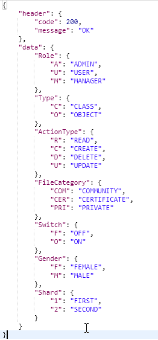
